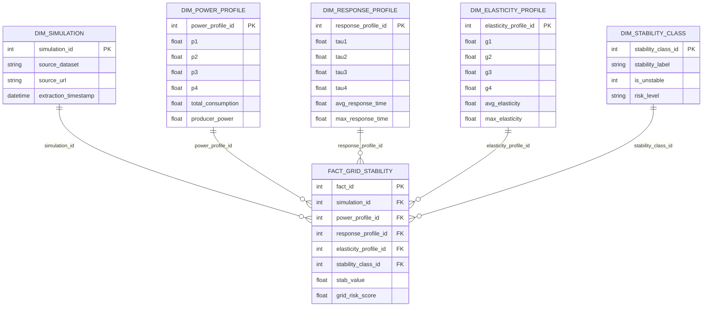

# Arquitetura do Projeto — Star Schema

## Visão geral

O projeto utiliza uma arquitetura analítica simples, porém completa:

1. **Camada Raw/Bronze:** dataset original baixado da UCI.
2. **Camada Silver:** limpeza, padronização, tipagem e criação de variáveis derivadas.
3. **Camada Gold:** modelagem dimensional em Star Schema.
4. **Camada Analytics:** EDA, Machine Learning e Business Insights.

## Star Schema

## Justificativa técnica

A modelagem separa características operacionais em dimensões analíticas. Isso facilita consultas OLAP, segmentações por perfil de potência, resposta e elasticidade, além de permitir análise histórica caso novos lotes de dados sejam incorporados ao pipeline.
